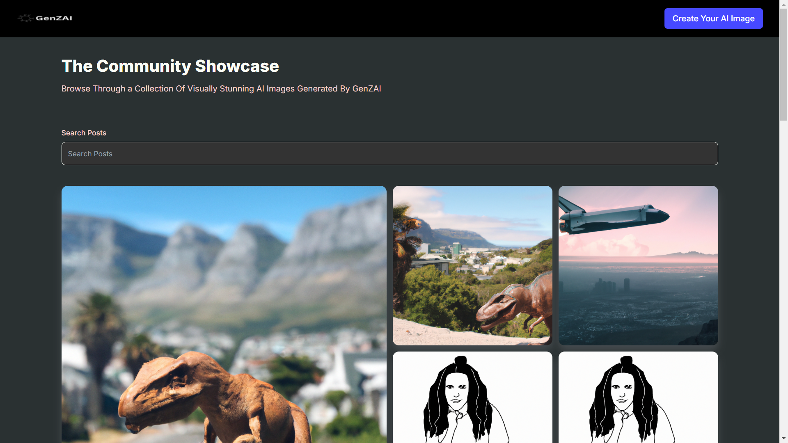

# GenZAI: Unleash Your Creativity with AI Image Generation (MERN)
live WEbAPP link - https://65c739965afb41498450e9da--peppy-frangipane-096f75.netlify.app/

Welcome to GenZAI, a full-stack web application that empowers you to transform text into stunning visuals using the cutting-edge OpenAI DALL-E model. Built with the powerful MERN stack (Node.js, Express.js, MongoDB, React.js) and enhanced by the popular Tailwind CSS framework, GenZAI offers a seamless and visually captivating experience for users of all skill levels.

#key App Features:
Generate and Share with Our Great AI Community
it has Community Tab to showcase your Prompting Skills

#Key Features:

*Effortless Text-to-Image Generation: Simply describe your vision, and GenZAI brings it to life with incredible visuals powered by OpenAI DALL-E.   
*Intuitive and User-Friendly Interface: Navigate GenZAI with ease thanks to the clean and modern interface built with Tailwind CSS.       
*Robust and Scalable Architecture: The MERN stack ensures a reliable and flexible foundation for your application, ready to handle growing needs.     
*Secure Image Storage: Trustfully store your generated images in the cloud using Cloudinary's secure and efficient storage solutions.       
*Open-Source and Collaborative: Contribute to the ongoing development of GenZAI and learn from a vibrant community.       

